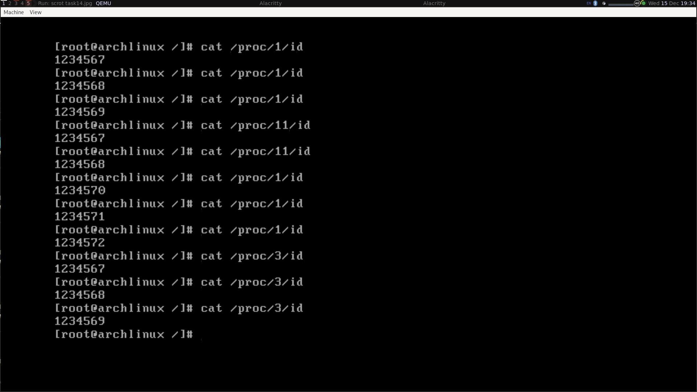

# Task 14
The patch 0001-Add-id-to-task\_struct.patch should be applied on the 5.15 kernel.

```bash
cd kernel_directory
git checkout -b testing v5.15
git apply 0001-Add-id-to-task\_struct.patch
make bzImage
virtme-run --kimg arch/x86/boot/bzImage
```

The working has been tested with virtme-run (Qemu). You can see a screenshot below.


