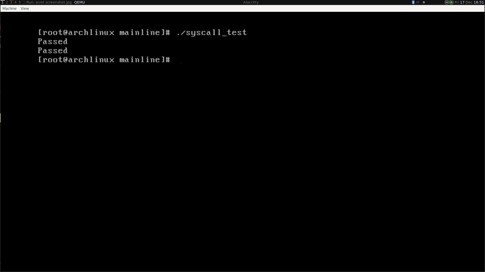

# Task 15
The patch "0001-Add-sys_eudyptula-syscall.patch" should be applied on the 5.15 kernel.

The architecture I use is x86_64 and I have used the syscall number 449 for sys_eudyptula.

```bash
cd kernel_directory
git checkout -b testing v5.15
git apply 0001-Add-sys_eudyptula-syscall.patch
make bzImage
```

Test the syscall using the userspace program "eudyptula_syscall.c"
```bash
gcc eudyptula_syscall.c -o syscall_test
virtme-run --kimg arch/x86/boot/bzImage
# Inside VM
./syscall_test
```

The working has been tested with virtme-run (Qemu). You can see a screenshot below.


